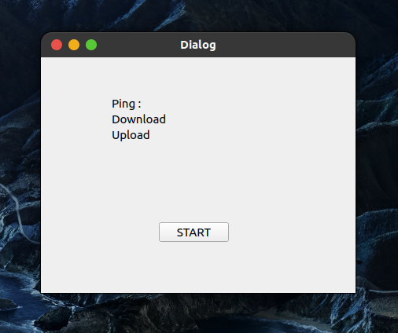
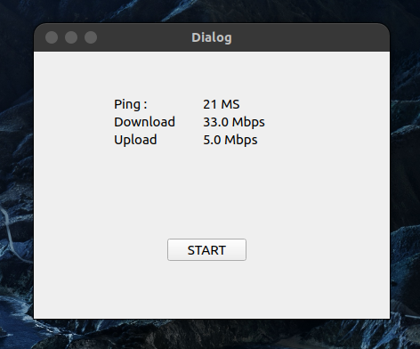

# Python Talking Voice Assistant

A silly talking assistant app (upgradeable)

## Installation


```bash
git clone https://github.com/ilkay-alti/Speed-Test.git

```

## Start Assistant

```bash
python main.py
```

## Voice Command
```python

Test is pressed when pressing the start button

```

```python

in a few seconds the results are showing on our panel

```

## Contributing
Pull requests are welcome. For major changes, please open an issue first to discuss what you would like to change.

Please make sure to update tests as appropriate.

## License
[MIT](https://choosealicense.com/licenses/mit/)
